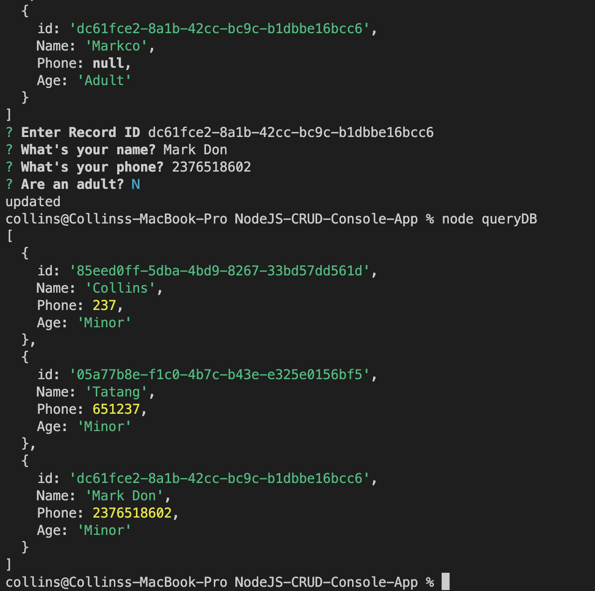

<a name="readme-top"></a>

<div align="center">
  <h3><b>NodeJS CRUD Console App</b></h3>

</div>

<!-- TABLE OF CONTENTS -->

# 📗 Table of Contents

- [📖 About the Project](#about-project)
  - [🛠 Built With](#built-with)
    - [Tech Stack](#tech-stack)
    - [Key Features](#key-features)
- [💻 Getting Started](#getting-started)
  - [Setup](#setup)
  - [Prerequisites](#prerequisites)
  - [Install](#install)
  - [Usage](#usage)
  - [Run tests](#run-tests)
- [👥 Authors](#authors)
- [🔭 Future Features](#future-features)
- [🤝 Contributing](#contributing)
- [⭐️ Show your support](#support)
- [🙏 Acknowledgements](#acknowledgements)
- [❓ FAQ (OPTIONAL)](#faq)
- [📝 License](#license)

<!-- PROJECT DESCRIPTION -->

# 📖 NodeJS CRUD Console App <a name="about-project"></a> 

**CRUD Console App** permits users to be able to Create Read Update and Delete items in the database file.

## 🛠 Built With <a name="built-with"></a>

### Tech Stack <a name="tech-stack"></a>

<details>
  <summary>Node</summary>
  <ul>
    <li><a href="https://nodejs.org/en">Node.js</a></li>
  </ul>
</details>


<!-- Features -->
### Key Features <a name="key-features"></a>

- **Add Item**
- **Read Item**
- **Update Item**
- **Remove Item**

<p align="right">(<a href="#readme-top">back to top</a>)</p>

<!-- GETTING STARTED -->
## 💻 Getting Started <a name="getting-started"></a>

To get a local copy up and running, follow these steps.

### Prerequisites

In order to run this project you need:

### Setup

Clone this repository to your desired folder:

```sh
  cd my-folder
  git clone https://github.com/CollinsTatang/NodeJS-CRUD-Console-App.git
```

### Install

Install this project with:

```sh
  cd NodeJS-CRUD-Console-App
  npm install
```
### Usage

To run the project, execute the following command:

```sh
  node filename
```
### Run tests

To run tests, run the following command:

```sh
  npm test
```
<p align="right">(<a href="#readme-top">back to top</a>)</p>

<!-- AUTHORS -->
## 👥 Authors <a name="authors"></a>

👤**Makungang Collins Tatang**

- GitHub: [@CollinsTatang](https://github.com/CollinsTatang)
- Twitter: [@CollinsTatang1](https://twitter.com/CollinsTatang1)
- LinkedIn: [Makungang Collins Tatang](https://www.linkedin.com/in/makungang-collins/)

<p align="right">(<a href="#readme-top">back to top</a>)</p>

<!-- FUTURE FEATURES -->
## 🔭 Future Features <a name="future-features"></a>

- [ ] **Multiple Detele**
- [ ] **Add More Database Table**
- [ ] **Add Test**
- [ ] **Add To DOCKER**

<p align="right">(<a href="#readme-top">back to top</a>)</p>

<!-- CONTRIBUTING -->
## 🤝 Contributing <a name="contributing"></a>

Contributions, issues, and feature requests are welcome!

Feel free to check the [issues page](../../issues/).

<p align="right">(<a href="#readme-top">back to top</a>)</p>

<!-- SUPPORT -->
## ⭐️ Show your support <a name="support"></a>

If you find this project intresting and helpful please leave a star.

<p align="right">(<a href="#readme-top">back to top</a>)</p>

<!-- ACKNOWLEDGEMENTS -->
## 🙏 Acknowledgments <a name="acknowledgements"></a>

I would like to thank the FreeCodeCamp team for making it posible to have all the avialable resource I needed. 

<p align="right">(<a href="#readme-top">back to top</a>)</p>

<!-- LICENSE -->
## 📝 License <a name="license"></a>

This project is [MIT](./LICENSE) licensed.

<p align="right">(<a href="#readme-top">back to top</a>)</p>
